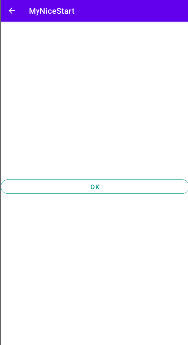

# MyNiceStart

[comment]:#(Esto se usa para comentar cosas en el readme, es decir,
 para que no sean visibles para el usuario que lo visualiza en github, por ejemplo)
 
 
 
 La primera imagen de la aplicación es esta: el splash, el cual tiene una animación 
 para el logo de la aplicación y un fondo introducido de un amanecer.
 
 
 
 La siguiente pestaña de la aplicación es la de login, la cual tiene 2 editText, 
 los cuales se utilizan para que se pueda introducir tu usuario y contraseña, 
 si ya estás registrado, un enlace en el texto por si todavía no estás registrado,
 y el botón para acceder a la aplicación.
 
 
 
 Si se pulsa e el texto para registrarte, la aplicación muestra una ventana en la que
 puedes introducir tu usario, contraseña y email para registrate en la aplicación.
 Si pulsas en el texto vuelves a la ventana de login; también hay un botón para ir a la
 ventana main.
 
  
 
 En la ventana main, tienes un botóń para acceder a main2, y una imagen de tu usuario. Una
 vez registrado, o iniciado sesión, no puedes volver a dichas ventanas.
 
  
  
  En la ventana de main2 solo hay un botón para volver a main.