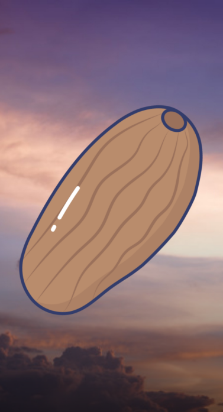
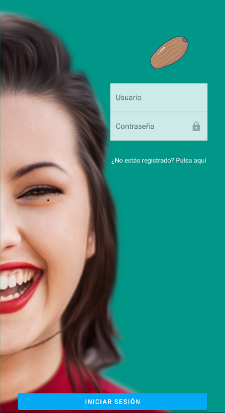
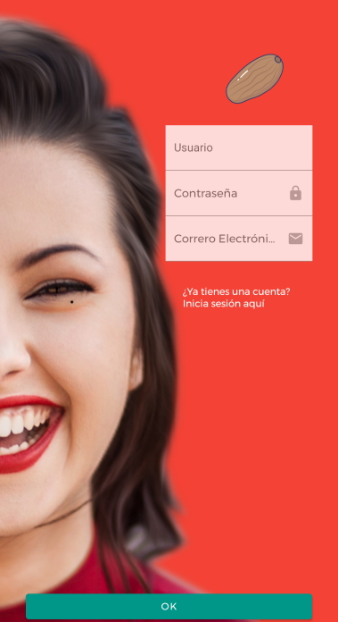
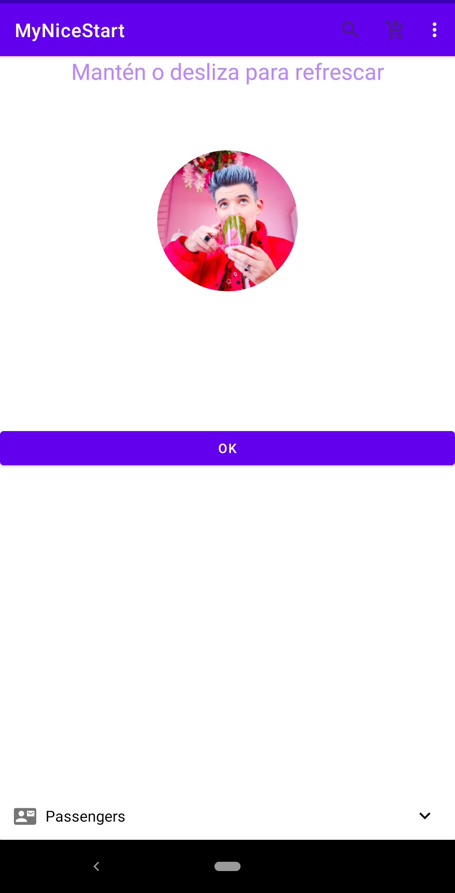
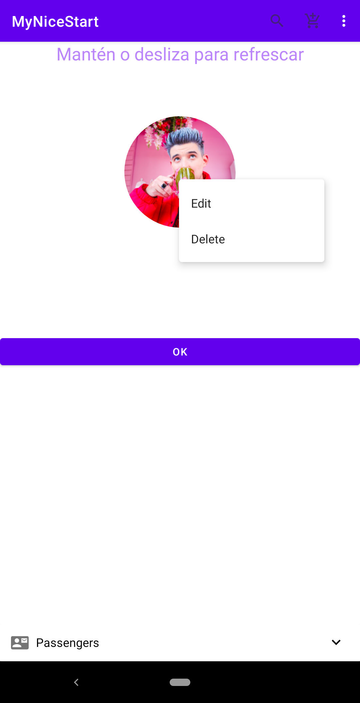
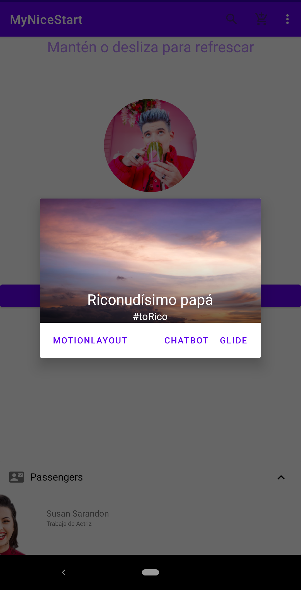
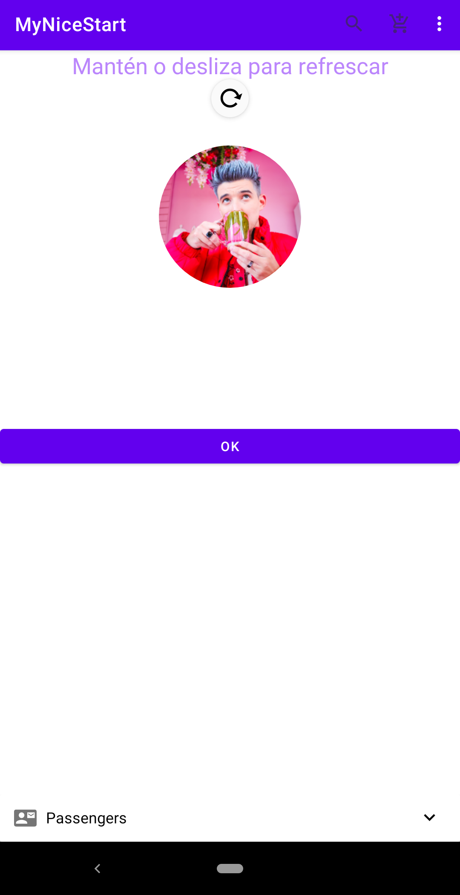
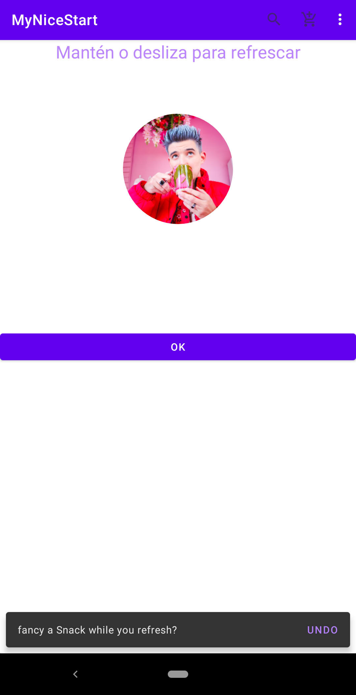
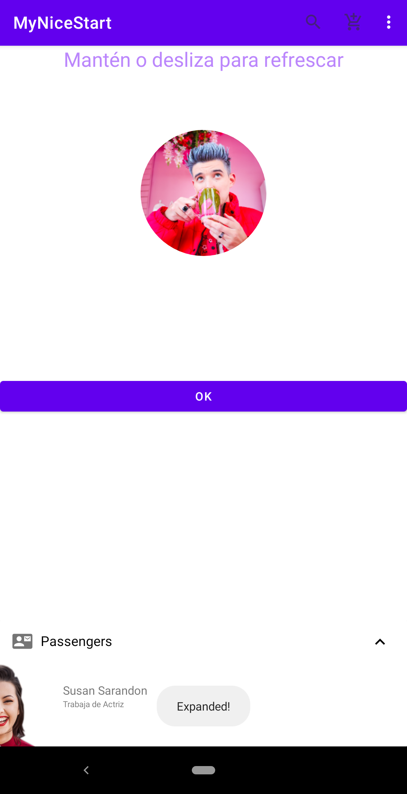
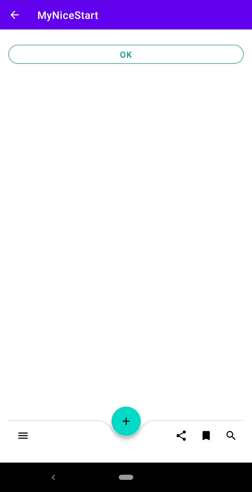

# MyNiceStart

[comment]:#(Esto se usa para comentar cosas en el readme, es decir,
 para que no sean visibles para el usuario que lo visualiza en github, por ejemplo)

 ##SplashActivity

 
 
 La primera imagen de la aplicación es esta: el splash, el cual tiene una animación 
 para el logo de la aplicación y un fondo introducido de un amanecer.

 ##LoginActivity

 
 
 La siguiente pestaña de la aplicación es la de login, la cual tiene 2 editText, 
 los cuales se utilizan para que se pueda introducir tu usuario y contraseña, 
 si ya estás registrado, un enlace en el texto por si todavía no estás registrado,
 y el botón para acceder a la aplicación.

 ##RegiterActivity

 
 
 Si se pulsa e el texto para registrarte, la aplicación muestra una ventana en la que
 puedes introducir tu usario, contraseña y email para registrarte en la aplicación.
 Si pulsas en el texto vuelves a la ventana de login; también hay un botón para ir a la
 ventana main.

 ##MainActivity

 
 
 En la ventana main, tienes un botóń para acceder a main2, una imagen de tu usuario en
 la que, si mantienes encima, aparece un menú contextual, un MenuAppBar en la parte de arriba,
 con el cual podemos invocar a un alertDIalog si se pulsa en el carrito y, si se pulsa en
 los puntitos se muestra la opción Settings, con 3 opciones, un expandableCardView que
 muestra al usuario actual, y un swipeRefresh, que muestra un snackbar.

 ###Menú Contextual

 

 MenuAppBar con 3 opciones, la de los puntitos muestra "Settings".

 ###Alert Dialog

 

 Alert Dialog al pulsar en el carrito.

 ###SwipeRefresh

 

 Opción para refrescar la vista (Swipe Refresh).

 ###Snackbar del Swipe Refresh

 

 Snackbar que se muestra al actualizar la vista.

 ###Card VIew Expandido

 

 ExpandableCardView que muestra la información actual del usuario.

 Una vez registrado, o iniciado sesión, no puedes volver a las ventanas anteriores.

 ##Main2

 
  
 En la ventana de main2 solo hay un botón para volver a main, un botón flotante con un
 AppBar, y la flecha para volver a la app anterior.

 ##La app también se ha testeado con su pertinente clase creada.

 ##El .aab se encuentra en la carpeta de release, en la vista de project.